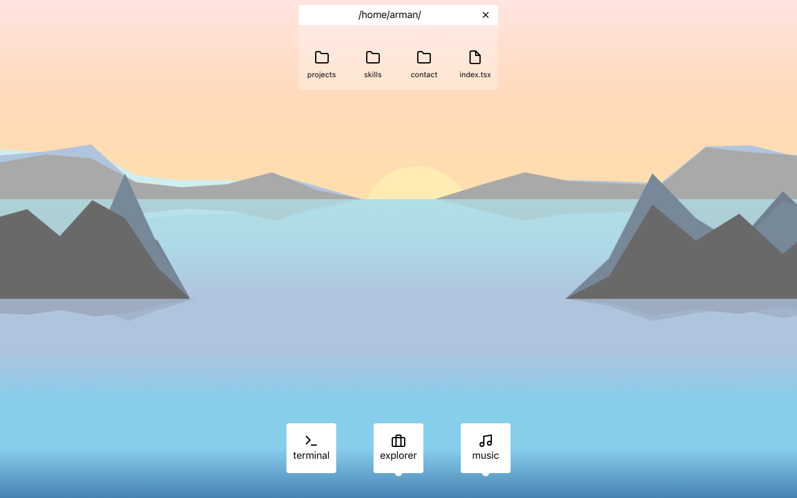

# Moidotsh - A Desktop-like Personal Website

## Introduction

Welcome to Moidotsh! This is a personal website designed to mimic a desktop interface. 

Built with Next.js and TypeScript, it offers a unique user experience with a terminal, app dock, and folder/file display.



## Features

- **Terminal**: Navigate the website like you would with a command line.
- **App Dock**: Quick access to different sections of the site.
- **Folder/File Display**: A file explorer-like UI to browse through content.
- **Additional Pages**: Includes pages for contact, projects, and skills.

## Tech Stack

- Next.js
- TypeScript
- TailwindCSS
- State Management with custom stores

## Getting Started

### Prerequisites

- Node.js
- npm or yarn

### Installation

1. Clone the repository
   ```bash
   git clone https://github.com/persakiss/moidotsh.git

2. Navigate to the project directory
   ```bash
   bun install

3. Run the development server
   ```bash
   bun run dev


